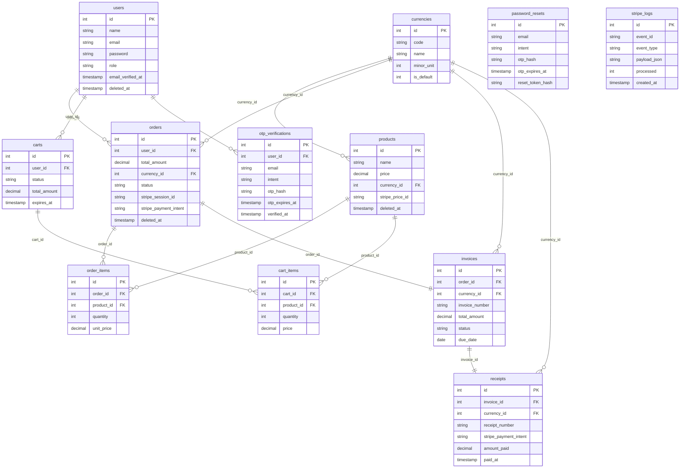

# Database ER diagram (Mermaid)

Paste into GitHub, Notion, or [Mermaid Live Editor](https://mermaid.live/).

- `password_resets` has no foreign keys (keyed by email).
- `stripe_logs` has no FKs; `event_id` is **UNIQUE** when set (Stripe `evt_…`) for webhook idempotency; `processed` is `0` until handling finishes. `payload` is JSON in MySQL (`payload_json` here is a label for Mermaid).
